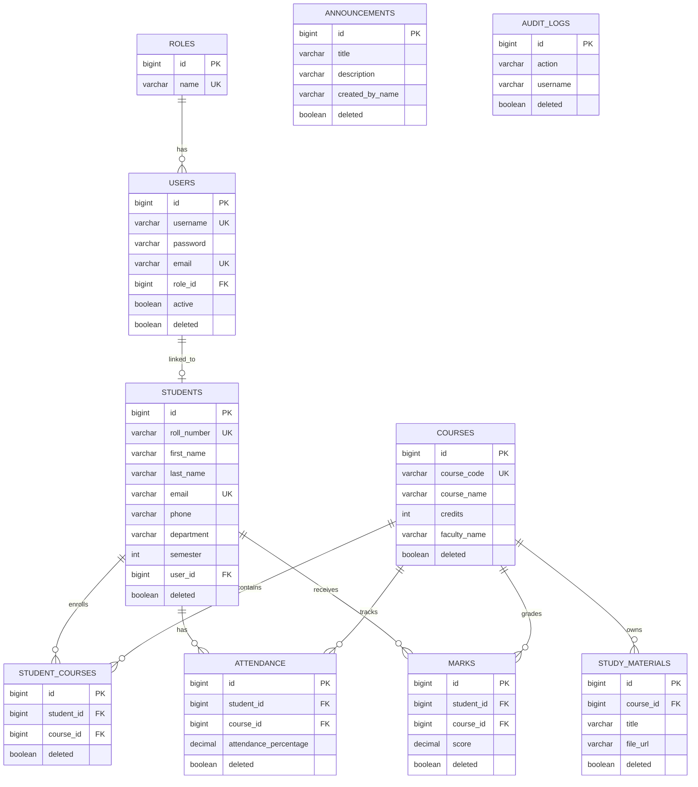

# ER Diagram

Unique constraints:

- `roles.name`
- `users.username`, `users.email`
- `students.roll_number`, `students.email`
- `courses.course_code`
- `student_courses(student_id, course_id)`
- `attendance(student_id, course_id)`
- `marks(student_id, course_id)`
